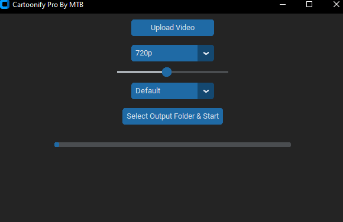

# 🎨 Cartoonify Pro - Video Cartoonizer by MTB

This is an offline desktop application that transforms your videos into cartoon-style animations using OpenCV and AI-inspired filters. Choose from styles like **Comic**, **Watercolor**, **AI Anime**, and **Pixar**, then export your cartoonified video in 480p, 720p, or 1080p resolution.

---

## ✨ Features

- 🎞️ Upload `.mp4` or `.avi` videos
- 🖌️ Apply various cartoon styles: Default, Comic, Watercolor, AI Anime, Pixar
- 📺 Export in 480p / 720p / 1080p
- ⏱️ Real-time progress bar
- 🧠 Multithreaded video processing
- 🌙 Modern dark-mode GUI with `customtkinter`
- 🔌 Works 100% offline — no internet needed

---

## 🧰 Built With

- Python 3.8+
- OpenCV
- customtkinter
- CTkMessagebox
- imageio
- Pillow

---

## 🛠️ Usage Example

1. **Upload a video**: Click on 'Upload Video' and select your `.mp4` or `.avi` file.
2. **Choose a style**: Select from Default, Comic, Watercolor, AI Anime, or Pixar.
3. **Set resolution**: Pick 480p, 720p, or 1080p.
4. **Adjust cartoon level**: Use the slider to set the desired effect intensity.
5. **Process and save**: Click on 'Select Output Folder & Start' to begin processing and save the output.

---

## 🧪 Testing

To test the application:

1. Run the script:
   ```bash
   python cartoonify_pro_by_mtb.py

---

## 🚀 Installation & Setup

### 1. Clone the Repository
```bash
git clone https://github.com/MTB-RZ/Cartoonify-Video-Cartoonizer-by-MTB.git
cd Cartoonify-Video-Cartoonizer-by-MTB
